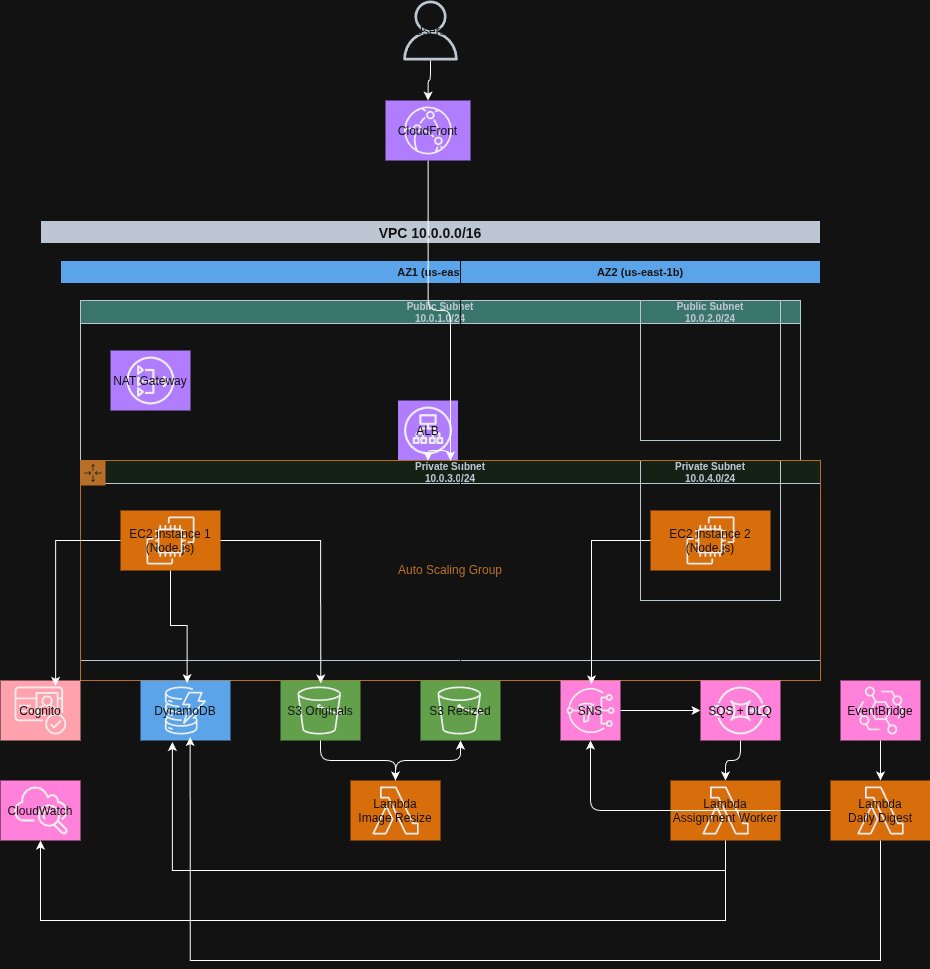

# Mini-Jira on AWS - Architecture

This document describes the target AWS architecture for Mini-Jira, aligned with the project requirements and the deployment guide.

## Architecture diagram (AWS standard icons)

**Requirement:** The detailed architecture **must** be drawn using AWS standard icons from https://aws.amazon.com/architecture/icons/ (e.g., via PowerPoint, Lucidchart, or a similar tool). Export the diagram as an image and reference it here:



## Live Application
[https://d1aq0trlgr7xf6.cloudfront.net](https://d1aq0trlgr7xf6.cloudfront.net) check docs for architecture

Text-only reference (not a substitute for the AWS-icons diagram):

```mermaid
flowchart TB
  user[Users] --> cf[CloudFront]
  cf --> alb[Application Load Balancer]
  cf --> s3static[(S3 Static Frontend - Optional)]
  alb --> asg[EC2 Auto Scaling Group (2+ AZs)]
  asg --> api[Node.js Backend]
  api --> ddb[(DynamoDB)]
  api --> s3orig[(S3 Originals)]
  s3orig --> lambdaResize[Lambda: Image Resize]
  lambdaResize --> s3thumb[(S3 Resized)]
  api --> sns[(SNS Topic)]
  sns --> sqs[(SQS Queue + DLQ)]
  sqs --> lambdaWorker[Lambda: Assignment Worker]
  lambdaWorker --> ddb
  lambdaWorker --> cw[(CloudWatch Metrics)]
  eb[EventBridge Schedule] --> lambdaDigest[Lambda: Daily Digest]
  lambdaDigest --> ddb
  lambdaDigest --> sns
  cw --> alarm[CloudWatch Alarm -> SNS Email]
  cognito[(Cognito User Pool)] --> api
```

## High-level overview

The system is deployed across **two Availability Zones** for high availability. Incoming traffic is routed through **CloudFront** and an **Application Load Balancer** to a **private EC2 Auto Scaling Group** running the Node.js backend. The application uses **DynamoDB** for all persistent data, **S3** for task attachments, **Lambda** for image processing and background workers, and **SNS/SQS/EventBridge** for event-driven workflows. Authentication is handled by **Cognito**, and **CloudWatch** provides metrics, dashboards, and alarms.

## Core components

| Layer | Service | Purpose |
| --- | --- | --- |
| Edge | CloudFront | CDN for frontend assets and API routing (`/api/*` to ALB). |
| Load Balancing | Application Load Balancer | Distributes traffic across EC2 instances; health checks at `/api/health`. |
| Compute | EC2 Auto Scaling Group | Hosts Node.js backend in **private subnets** across 2 AZs. |
| Auth | Cognito User Pool | Sign-in/sign-up, stores `custom:role` and `custom:teamId`. |
| Data | DynamoDB | Tables for Users, Teams, Projects, Tasks (GSIs on `teamId`, `assigneeId`, `status+deadline`), Comments, Audit Log. |
| Storage | S3 (originals) | Stores uploaded task images with versioning. |
| Storage | S3 (resized) | Stores thumbnails from resize Lambda. |
| Serverless | Lambda (Image Resize) | Triggered by S3 PUT on `tasks/` prefix. |
| Messaging | SNS | Fan-out on task assignment (email + SQS). |
| Messaging | SQS + DLQ | Decouples assignment processing; triggers worker Lambda. |
| Serverless | Lambda (Assignment Worker) | Writes audit log and emits CloudWatch custom metrics. |
| Serverless | Lambda (Daily Digest) | EventBridge scheduled; sends due-today digest via SNS. |
| Observability | CloudWatch | Custom metrics, dashboard widgets, and alarms. |
| Networking | VPC + Subnets | Public subnets for ALB/NAT; private subnets for EC2. |
| Security | IAM Roles | Least-privilege roles for EC2 and each Lambda. |

## Networking and availability

- **VPC** with 2 public subnets (ALB, NAT) and 2 private subnets (EC2 ASG).
- **NAT Gateway** in a public subnet for outbound internet access from private EC2 instances.
- **ALB** spans public subnets across two AZs.
- **Auto Scaling Group** spans private subnets across two AZs (desired capacity >= 2).

## Authentication and authorization

- Users authenticate via **Cognito**. Backend validates JWTs on every request.
- Role model:
  - **Manager**: full visibility across teams.
  - **Employee**: restricted to their own team.
- **Team isolation** is enforced server-side: Tasks table has a GSI on `teamId`, and every API handler checks team membership unless role is Manager.

## Data model (DynamoDB)

| Table | Primary Key | GSIs |
| --- | --- | --- |
| Users | `userId` | None |
| Teams | `teamId` | None |
| Projects | `projectId` | None |
| Tasks | `taskId` | `teamId-index`, `assigneeId-index`, `status-deadline-index` |
| Comments | `commentId` | `taskId-index` |
| Audit Log | `logId` | `taskId-index` |

## Event-driven workflows

1. **Task assignment**
   1. Backend publishes assignment event to **SNS**.
   2. **SNS** delivers to:
      - Email subscription (assignee notification).
      - **SQS** queue.
   3. **Assignment Worker Lambda** consumes SQS, writes audit log, and publishes custom CloudWatch metric `TasksAssignedPerTeam`.

2. **Daily digest**
   1. **EventBridge** scheduled rule triggers at 09:00.
   2. **Daily Digest Lambda** queries `status-deadline-index` for tasks due today.
   3. Lambda publishes digest emails via **SNS** and emits metric `OverdueTasks`.

3. **Image processing**
   1. Task image uploaded to **S3 originals** bucket.
   2. **Image Resize Lambda** triggers on S3 PUT and writes thumbnail to **S3 resized** bucket.

## Observability

**CloudWatch Dashboard** (minimum widgets):
1. Tasks created per day
2. Tasks closed per day per team
3. Average time-to-close
4. EC2 CPU utilization

**Alarms**:
- Example: `OverdueTasks` > 10 triggers an SNS notification.

## Frontend delivery options

- **Option A (SSR)**: Frontend served from EC2 behind ALB; CloudFront caches responses.
- **Option B (Static)**: Build output synced to S3 static hosting; CloudFront serves static assets and routes `/api/*` to ALB.

## Security notes

- EC2 instances are in **private subnets** and only reachable through the ALB.
- Security groups:
  - **ALB-SG**: inbound 80/443 from the internet.
  - **EC2-SG**: inbound 3000 only from ALB-SG.
- IAM roles grant only required permissions; Lambdas are **not** placed in the VPC.
